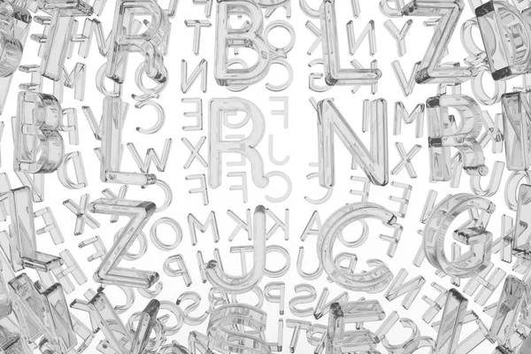
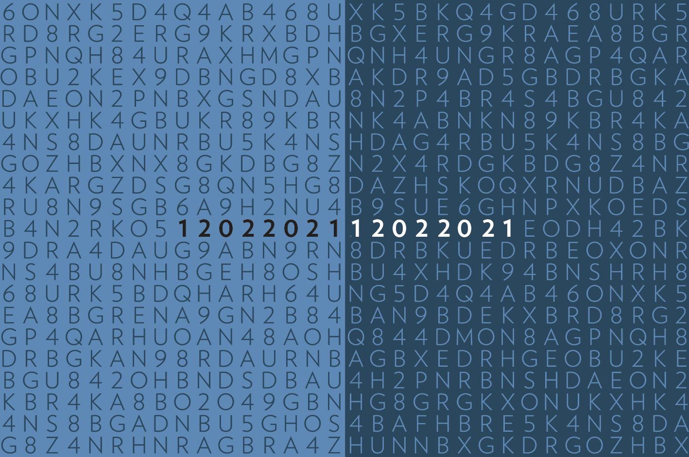
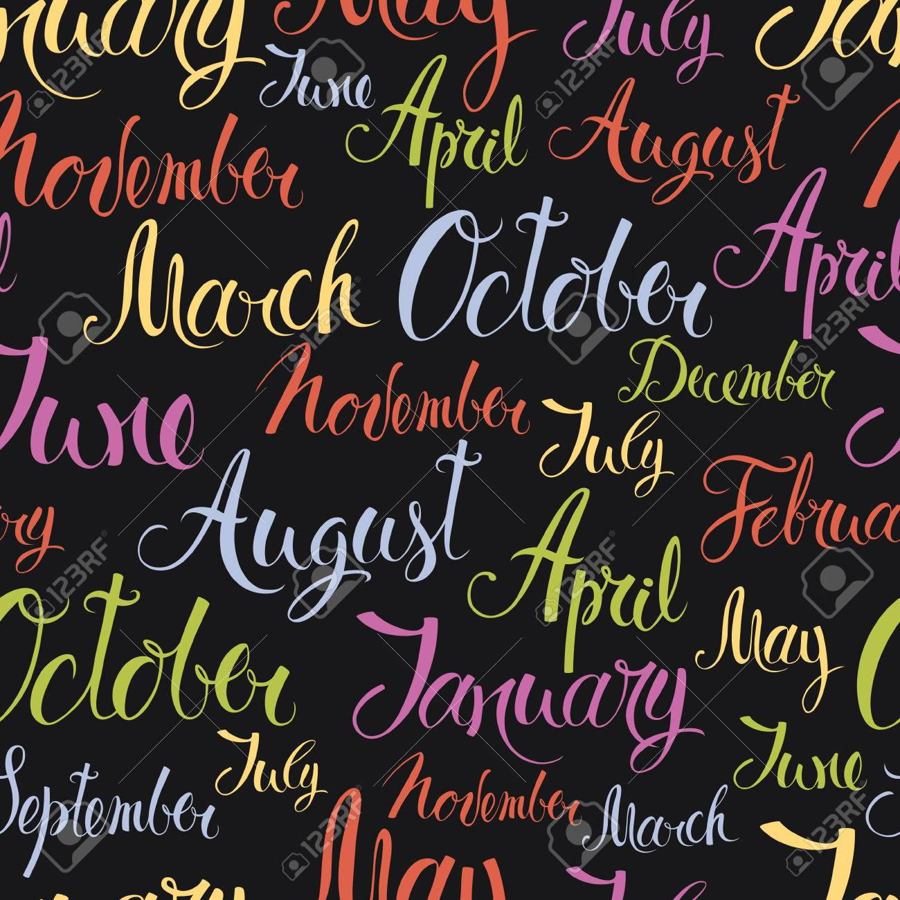

<h1>Ejercicios JavaScript</h1>
<h3>Índice</h3>

Muestro un indice con las acticidades dentros de varias cards, en la cual si pinchas te lleva a las actividades.

 
<h3>Ejercicio 2</h3>

Lo que he hecho basicamente es pedir el radio, y después calcular la longitud,área y volúmen.

He utilizado de fondo esta foto.

Y lo que es en cuanto a la estructura de formulario he utilizado bootstrap en todos.

 
<h3>Ejercicio 3</h3>

Lo que hago es pedir los lados, y te digo el tipo de triángulo.

He utilizado de fondo esta foto.

 
<h3>Ejercicio 4</h3>

Lo que hago es pedir los números del dni, y a partir de los números te averiguo la letra.

He utilizado de fondo esta foto.

 

<h3>Ejercicio 5</h3>

Lo que hago es pedir una cadena de carácteres, y te digo si es solo mayúscula, solo minúscula o contiene de las dos.

He utilizado de fondo esta foto.

 

<h3>Ejercicio 6</h3>

Ahora pido una palabra y si es palindromo te pone que es palíndromo, si no es palíndromo te dice que no es palíndro te pone la palabra en orden y después seguida inversa.

He utilizado de fondo esta foto.

 

<h3>Ejercicio 7</h3>

Pido dividendo y divisor y te digo el cociente y el resto.

He utilizado de fondo esta foto.

 

<h3>Ejercicio 8</h3>

Ahora pido dos número y te hago el máximo común divisor.

He utilizado de fondo esta foto.

 

<h3>Ejercicio 9</h3>

Ahora hay un campo select y dependiendo del número que escojas te dice un mes u otro, por ejemplo con el 1 es enero.

He utilizado de fondo esta foto.

